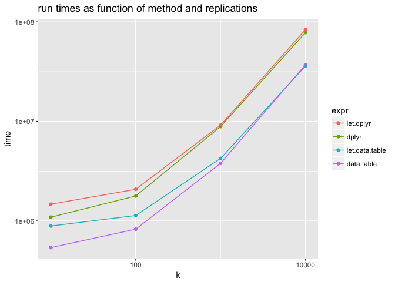

``` r
# small timings
library("data.table")
library("dplyr")
 #  --------------------------------------------------------------------------------------------------
 #  data.table + dplyr code now lives in dtplyr.
 #  Please library(dtplyr)!
 #  --------------------------------------------------------------------------------------------------
 #  
 #  Attaching package: 'dplyr'
 #  The following objects are masked from 'package:data.table':
 #  
 #      between, first, last
 #  The following objects are masked from 'package:stats':
 #  
 #      filter, lag
 #  The following objects are masked from 'package:base':
 #  
 #      intersect, setdiff, setequal, union
library("microbenchmark")
library("replyr")
library("ggplot2")

set.seed(32535)

data("iris",package = "datasets")
iris.dt <- data.table(iris)

iris.dt[, mean(Sepal.Length), by=Species]
 #        Species    V1
 #  1:     setosa 5.006
 #  2: versicolor 5.936
 #  3:  virginica 6.588

let(list(GROUPCOL='Species', DATACOL='Sepal.Length'),
    iris.dt[, mean(DATACOL), by=GROUPCOL])
 #        Species    V1
 #  1:     setosa 5.006
 #  2: versicolor 5.936
 #  3:  virginica 6.588

iris %>% group_by(Species) %>% summarize(mean(Sepal.Length))
 #  # A tibble: 3 × 2
 #       Species `mean(Sepal.Length)`
 #        <fctr>                <dbl>
 #  1     setosa                5.006
 #  2 versicolor                5.936
 #  3  virginica                6.588

let(list(GROUPCOL='Species', DATACOL='Sepal.Length'),
    iris %>% group_by(GROUPCOL) %>% summarize(mean(DATACOL)))
 #  # A tibble: 3 × 2
 #       Species `mean(Sepal.Length)`
 #        <fctr>                <dbl>
 #  1     setosa                5.006
 #  2 versicolor                5.936
 #  3  virginica                6.588

# gapply is very bad at this task both notationally, and in terms of speed
gapply(iris, 'Species',
       function(di) {
         mean(di[['Sepal.Length']])
       },
       partitionMethod = 'split',
       bindrows=FALSE)
 #  $setosa
 #  [1] 5.006
 #  
 #  $versicolor
 #  [1] 5.936
 #  
 #  $virginica
 #  [1] 6.588

ks <- 10^(1:4)

res <- lapply(ks,function(k) {
  irisk <- iris[rep(seq_len(nrow(iris)),k),,drop=FALSE]
  irisk.dt <- data.table(irisk)
  meas <- microbenchmark(data.table= irisk.dt[, mean(Sepal.Length), by=Species],
                         dplyr= irisk %>% group_by(Species) %>% summarize(mean(Sepal.Length)),
                         let.data.table= let(list(GROUPCOL='Species', DATACOL='Sepal.Length'),
                                             irisk.dt[, mean(DATACOL), by=GROUPCOL]),
                         let.dplyr= let(list(GROUPCOL='Species', DATACOL='Sepal.Length'),
                                        irisk %>% group_by(GROUPCOL) %>% summarize(mean(DATACOL))))
  meas %>%
    as.data.frame() %>%
    aggregate(time~expr,data=.,FUN=mean) %>% mutate(k=k) ->
    summaryk
  summaryk
})

res <- dplyr::bind_rows(res)
res$expr <- reorder(res$expr, -res$time)

ggplot(data=res,aes(x=k,y=time,color=expr)) +
  geom_point() + geom_line() +
  scale_x_log10() + scale_y_log10() +
  ggtitle("run times as function of method and replications")
```


