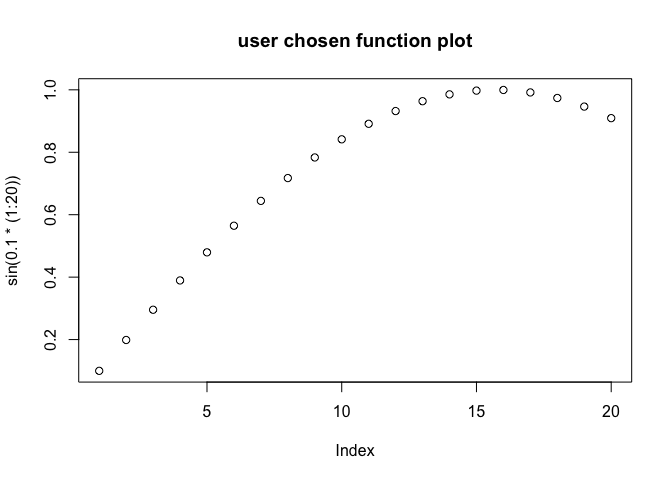
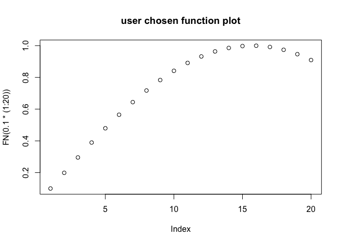

[Jason Becker](http://jsonbecker.com) recently noticed that [`replyr::let`](https://github.com/WinVector/replyr) works well in binding [`R`](https://cran.r-project.org) [`knitr`](https://CRAN.R-project.org/package=knitr) worksheet parameters ([link](https://twitter.com/jsonbecker/status/815953228642811905)) (and the same likely holds for [`shiny`](http://shiny.rstudio.com)). This isn't something you want to expose to end-users, but is very powerful in managing your own reproducible research.

The idea is: `knitr` already takes a `params` block which is an arbitrary `yaml` object and `replyr::let` is willing to treat string to string associations as name rebindings. If we just add the convention that all uppercase names are to be read as re-bindings (and not values) we can accept user specified function names and variable name directly from the RMarkdown controls.

For examine in the RMarkdown document that produced this note we included in the header the following params:

``` yaml
---
params:
  FN: sin
  VAR: east
  TITLE: "User chosen function plot"
---
```

Bindings
--------

The user assignments are available as variable name and function substitutions. We are using the convention that name bindings are specified in all caps (an option of `replyr::restrictToNameAssignments` available in version `0.2.01` and newer).

``` r
library("replyr")
print(params)
```

    ## $FN
    ## [1] "sin"
    ## 
    ## $VAR
    ## [1] "east"
    ## 
    ## $TITLE
    ## [1] "User chosen function plot"

``` r
east = 7
let(
  alias=restrictToNameAssignments(params),
  expr={ 
    print(paste(quote(VAR),VAR))
    plot(FN(0.1*(1:20)))
    title(params$TITLE)
  })
```

    ## [1] "east 7"



Values
------

Or, assuming everything you do is only standard evaluation and you don't care about capturing variable names: you can capture references to values once and have all subsequent blocks use those values.

``` r
FN <- let(restrictToNameAssignments(params), FN)

plot(FN(0.1*(1:20)))
title(params$title)
```



Notice the plot uses the user specified function, but does not know its original name (so can no longer print it in the y-axis).

Conclusion
----------

`replyr::let` takes `knitr` parameters one step further. The source for this note can be found [here](https://github.com/WinVector/replyr/blob/master/extras/KnitrParameters.Rmd) and the rendered output [here](https://github.com/WinVector/replyr/blob/master/extras/KnitrParameters.md).
