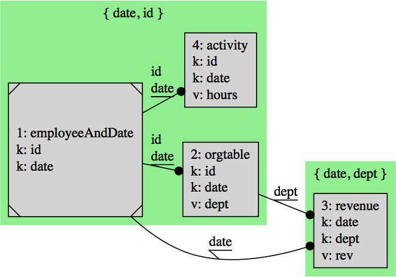

How to render join diagram directly into R Markdown (source code [here](https://github.com/WinVector/replyr/blob/master/extras/graphViz.Rmd)).

Converter info from: [here](https://stackoverflow.com/questions/31336898/how-to-save-leaflet-in-r-map-as-png-or-jpg-file).

``` r
library("replyr")
library("htmlwidgets")
library("webshot")
# webshot::install_phantomjs()

tDesc <- data.frame(tableName= c('employeeAndDate',
                                 'orgtable',
                                 'revenue',
                                 'activity'),
                    handle= I(list(NULL, NULL, NULL, NULL)),
                    columns= I(list(c('id', 'date'),
                                    c('id', 'date', 'dept'),
                                    c('date', 'dept', 'rev'),
                                    c('id', 'date', 'hours'))),
                    keys =  I(list( c('id', 'date'),
                                   c('id', 'date'),
                                   c('date', 'dept'),
                                   c('id', 'date'))),
                    colClass= I(list(c('character', 'numeric'),
                                     c('character', 'character', 'character'),
                                     c('numeric', 'character', 'numeric'),
                                     c('character', 'numeric', 'numeric'))),
                    sourceClass= 'None',
                    isEmpty= FALSE,
                    stringsAsFactors = FALSE)
diagramSpec <- makeJoinDiagramSpec(buildJoinPlan(tDesc))
diagram <- DiagrammeR::grViz(diagramSpec)


# render as HTML and then get an PNG webshot
saveDiagramAsPNG <- function(diagram, fileName) {
  dir <- tempdir()
  tempPath <- paste(dir, 'temp.html', sep= '/')
  saveWidget(diagram, tempPath, selfcontained = FALSE)
  webshot(tempPath, file = fileName,
          cliprect = "viewport")
  # intentionally not removing the temp directory, as it could be dangerous
  dir
}

pngName <- 'joinPlan.png'
saveDiagramAsPNG(diagram, pngName)
```

    ## [1] "/var/folders/7q/h_jp2vj131g5799gfnpzhdp80000gn/T//Rtmp13Rx1E"


